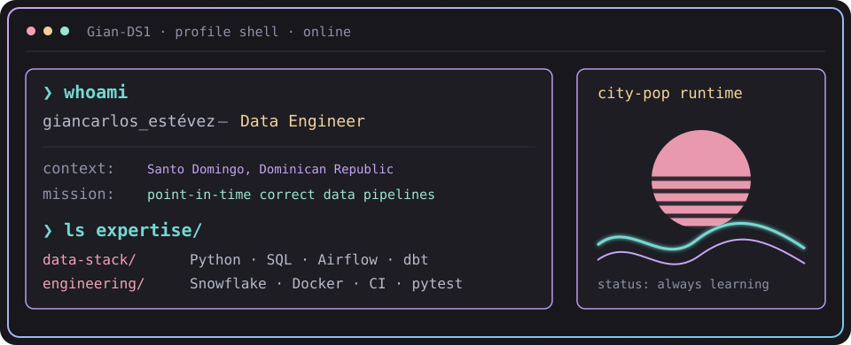

<a href="https://github.com/Gian-DS1">
  <picture>
    <source media="(prefers-color-scheme: dark)" srcset="assets/banner-dark.v9.svg">
    <source media="(prefers-color-scheme: light)" srcset="assets/banner-light.v9.svg">
    
  </picture>
</a>

 

 

---

## `$ whoami`

  

**Data engineer** · Santo Domingo, Dominican Republic · open to remote roles

I build data pipelines that hold up outside a notebook: real sources, point-in-time
correctness, tests and CI. MSc in Data Science & Business Analytics, currently studying
Software Engineering to pair the data side with solid engineering practice.

---

## `$ cat tech-stack.yaml`

<table>
  <thead>
    <tr><th colspan="2" align="left"><code>Gian-DS1:~$ cat tech-stack.yaml</code></th></tr>
  </thead>
  <tbody>
    <tr>
      <td width="50%" valign="top"><code>├─ ◈ data_foundations:</code>  
          
        
         
        <code>Python · SQL · pandas · Parquet</code>
      </td>
      <td width="50%" valign="top"><code>├─ ⇄ pipelines_warehouse:</code>  
         
         
         
        <code>Airflow · dbt · Snowflake</code>
      </td>
    </tr>
    <tr>
      <td valign="top"><code>├─ ✦ machine_learning:</code>  
         
        <code>scikit-learn · SHAP · FinBERT</code>
      </td>
      <td valign="top"><code>├─ ▣ api_engineering:</code>  
         
        <code>FastAPI · Node.js · Express · WebSocket</code>
      </td>
    </tr>
    <tr>
      <td valign="top"><code>├─ ⚙ delivery_quality:</code>  
          
        
        
         
        <code>Docker · GitHub Actions · pytest · Vitest · Playwright</code>
      </td>
      <td valign="top"><code>╰─ ⌁ also_worked_with:</code>  
          
        
        
         
        <code>AWS · Databricks · Power BI · Streamlit · React</code>
      </td>
    </tr>
  </tbody>
  <tfoot><tr><td colspan="2"><code>focus: data engineering · status: open to remote roles</code></td></tr></tfoot>
</table>

---

## `$ ls projects/`

### [Stock Screener ML](https://github.com/Gian-DS1/stock-screener-ml)

Equity screener for the S&P 500 + NASDAQ 100 built on a strict *point-in-time* pipeline:
fundamentals enter by their real SEC filing date, macro series by their ALFRED vintage,
and 8-K sentiment only from the next business day — so the backtest can't learn from the
future. Trained on 298k rows (515 tickers, 34 features), with SHAP explanations per
signal, a rule-based exit engine and graduated drift monitoring.

`Python` · `scikit-learn` · `SEC EDGAR` · `FRED` · `FinBERT` · `FastAPI` · `React` · `pytest` · `GitHub Actions`

### [FinTrack](https://github.com/Gian-DS1/fintrack) · [live app](https://fintrack-rd.vercel.app)

Personal-finance PWA: zero-based budgeting, credit-card cycles, debts and savings goals.
Multi-currency, bilingual (es/en), installable, and backed by Postgres row-level security
so each user only ever reaches their own rows.

`React 19` · `Vite` · `Supabase (Postgres + RLS)` · `Tailwind` · `Vitest` · `Playwright`

### [Zomato Data Pipeline](https://github.com/Gian-DS1/zomato-data-engineering-pipeline)

End-to-end batch pipeline on a modern data stack: ingestion into Snowflake, dbt staging
and mart models, Airflow orchestration, and an analytics layer with LLM review enrichment
and natural-language querying over the warehouse.

`Airflow` · `dbt` · `Snowflake` · `Python` · `Streamlit`

### [LIENZO](https://github.com/Gian-DS1/lienzo)

Desktop canvas for running several AI coding agents in parallel — each one in its own real
terminal, on an infinite board, driven by text or voice. macOS, Windows and Linux, with no
build step.

`Node.js` · `Express` · `WebSocket` · `xterm.js` · `node-pty`

---

## `$ python scripts/radar.py`

  <picture>
    <source media="(prefers-color-scheme: dark)" srcset="assets/radar-dark.svg">
    <source media="(prefers-color-scheme: light)" srcset="assets/radar-light.svg">
    
  </picture>
  <picture>
    <source media="(prefers-color-scheme: dark)" srcset="assets/radar-langs-dark.svg">
    <source media="(prefers-color-scheme: light)" srcset="assets/radar-langs-light.svg">
    
  </picture>

Project coverage: share of the four featured projects in each category. Language mix: public repository bytes, square-root scaled relative to the largest language. Snapshot: 2026-10-01.

---

## `$ git log --stats`

<picture>
  <source media="(prefers-color-scheme: dark)" srcset="./profile/stats-dark.svg">
  
</picture>
<picture>
  <source media="(prefers-color-scheme: dark)" srcset="./profile/langs-dark.svg">
  
</picture>

---

## `$ cat background.md`

- **MSc in Data Science & Business Analytics** — IMF Smart Education / UCAV, co-developed with Indra–Minsait
- Currently studying **Software Engineering**
- ~6 years in **customer service across regulated health and finance sectors** — real domain knowledge and the habit of absorbing complex business rules fast
- Spanish (native) · English (C1)
- Certifications: AWS Academy (ML & Cloud Foundations) · IBM Data Science · Google Cybersecurity

---

## `$ connect --socials`

&nbsp;&nbsp;

  

Santo Domingo, Dominican Republic · @Gian-DS1 · always learning 
City-pop design and SVG generators adapted from <a href="https://github.com/macu-dev/macu-dev">macu-dev/macu-dev</a>.

